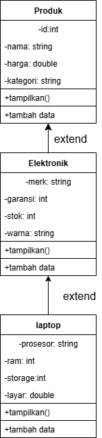
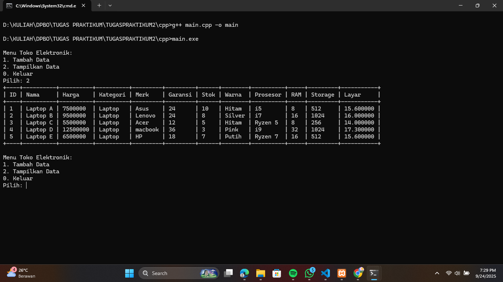
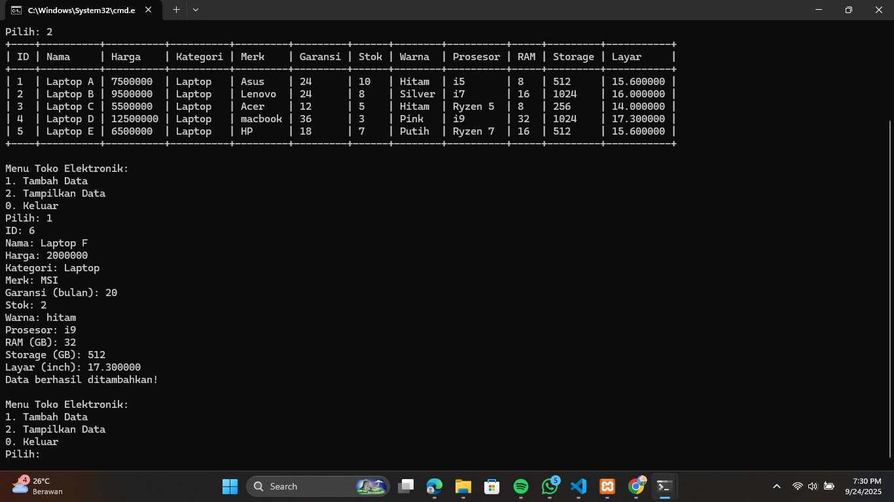
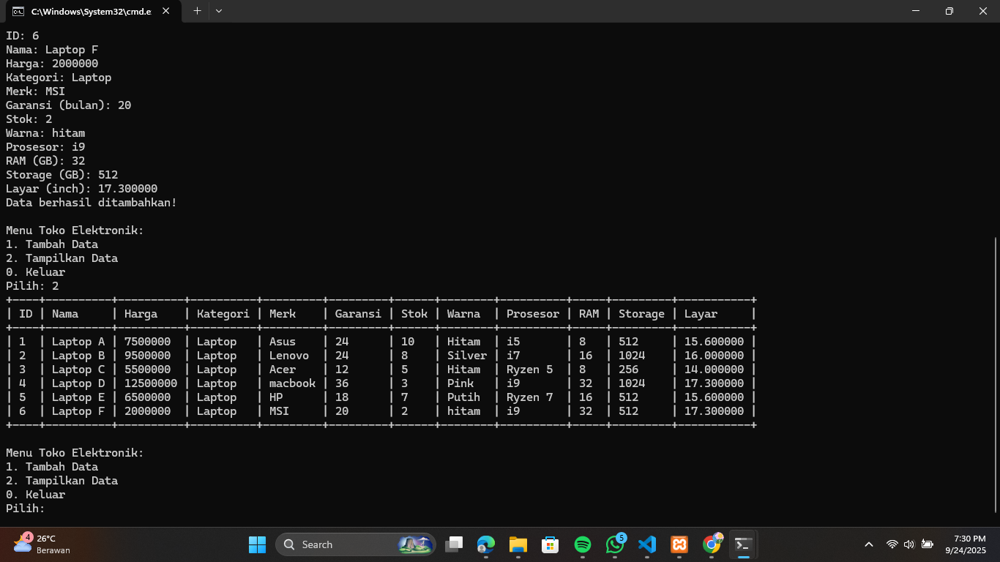
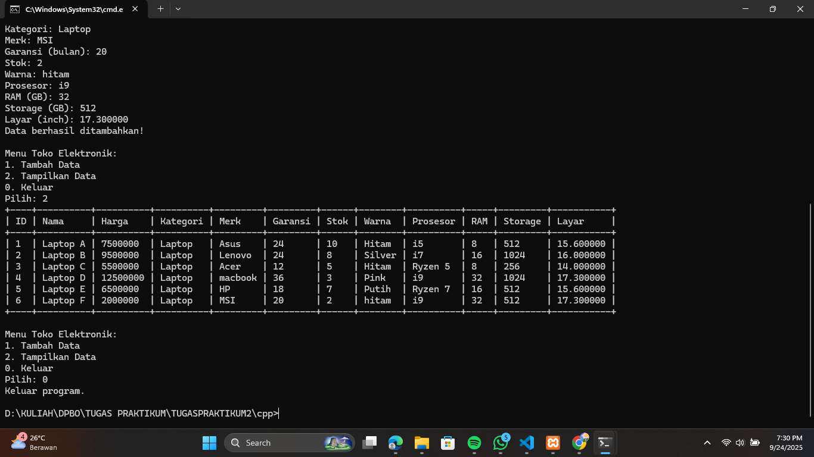
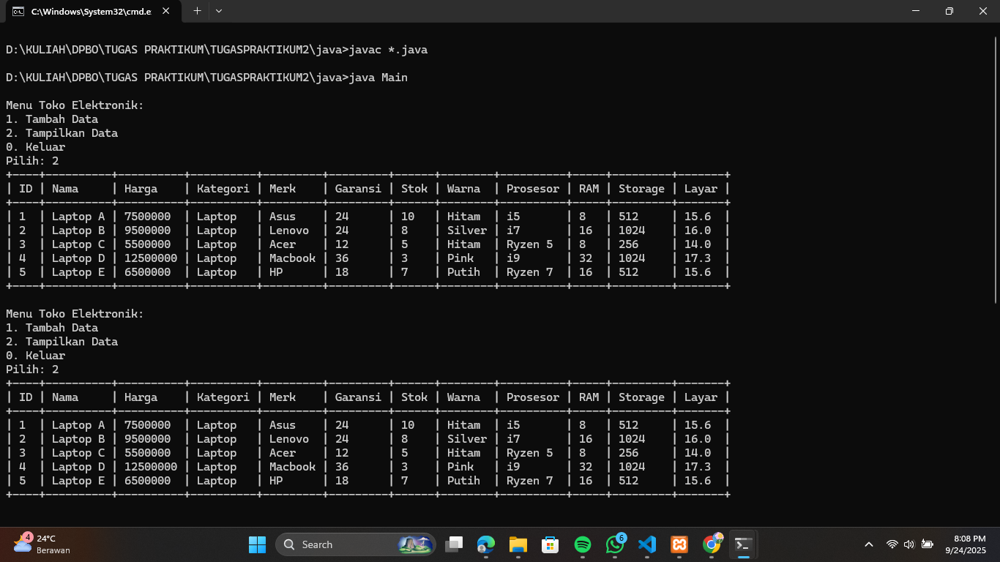
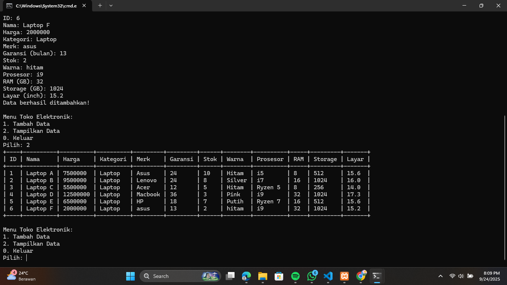
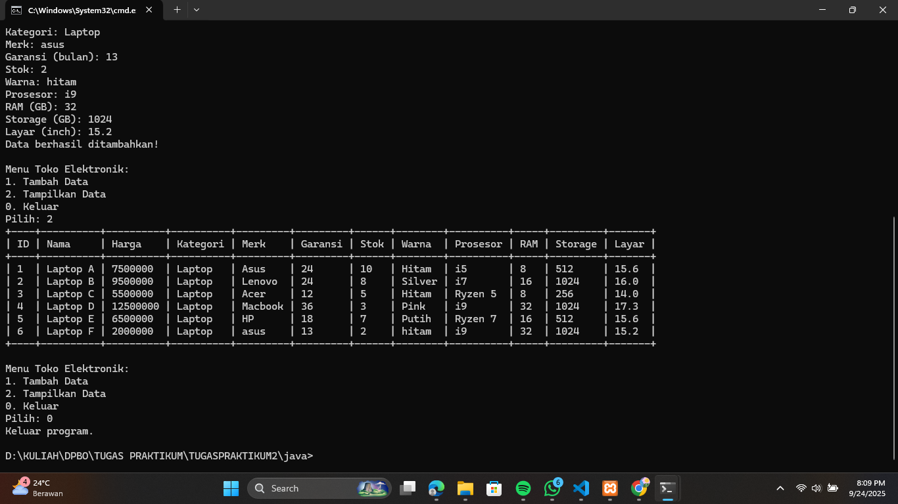
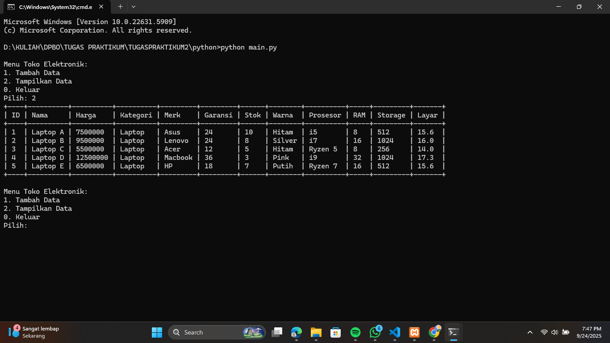

# TP2DPBO2425C2
TUGAS PRAKTIKUM 2

Janji:
Saya Nisrina Safinatunnajah dengan NIM 2410093 mengerjakan Tugas Praktikum 2 dalam mata kuliah DPBO untuk keberkahanNya maka saya tidak melakukan kecurangan seperti yang telah dispesifikasikan. Aamiin

1. penjelasan desain, methods dan flow kode program:
- Class Produk
Class ini dibuat untuk menampung atribut dasar dari sebuah produk elektronik, yaitu id, nama, harga, dan kategori. Class Produk menjadi parent dari class Elektronik dan Laptop karena semua produk elektronik pasti memiliki atribut-atribut dasar tersebut. Dengan membuat class Produk, atribut dasar ini dapat digunakan kembali oleh semua turunan di masa depan tanpa perlu didefinisikan ulang, sehingga meningkatkan reusabilitas dan menjaga konsistensi data antar class.

- Class Elektronik
Class ini merupakan turunan dari class Produk dan memiliki atribut tambahan yang spesifik untuk kategori elektronik, yaitu merk, garansi, stok, dan warna. Class Elektronik dibuat karena tidak semua produk memiliki atribut tambahan seperti ini, sehingga atribut tersebut khusus untuk elektronik. Class ini menjadi parent langsung dari class Laptop, sehingga semua atribut Elektronik akan dimiliki oleh Laptop. Dengan demikian, class Elektronik berfungsi sebagai level menengah dalam multilevel inheritance, memisahkan atribut umum elektronik dari atribut dasar Produk dan atribut khusus Laptop.

- Class Laptop
Class ini merupakan turunan dari class Elektronik dan menambahkan atribut spesifik untuk laptop, yaitu prosesor, ram, storage, dan layar. Class Laptop dibuat karena laptop adalah subkategori dari elektronik yang memiliki atribut tambahan berbeda dari elektronik lain. Semua instance di main program dibuat menggunakan class Laptop saja, sehingga objek sudah memiliki semua atribut dari Produk dan Elektronik.

2. Alur Program:

Program ini memiliki tiga fungsi utama. Method tampilkan digunakan untuk menampilkan seluruh data Laptop yang ada, mencakup semua atribut dari class parent (produk dan Elektronik) seperti id, nama, harga, kategori, merk, garansi, stok, dan warna, serta atribut khusus Laptop seperti prosesor, RAM, storage, dan layar. untuk PHP, foto produk juga ditampilkan. Method tambahData() bertugas untuk menambahkan laptop baru ke daftar data, menerima semua atribut Laptop dan parent-nya, saat menu interaktif digunakan, data yang ditambahkan langsung tersimpan dan siap ditampilkan. Sedangkan menu keluar menghentikan program atau loop interaktif dengan rapi tanpa menghapus data yang sudah tersimpan, sehingga user bisa mengakhiri program.

Inisialisasi Data Awal
Program pertama-tama membuat lima instance Laptop dengan atribut lengkap id, nama, harga, kategori, merk, garansi, stok, warna, prosesor, ram, storage, layar,untuk dijadikan data awal sebelum input user. 

Tampilan Menu
Program menampilkan menu interaktif dengan opsi untuk menambahkan data baru atau menampilkan tabel. PHP versi web menampilkan tabel langsung.

Input Data User
Jika user memilih menambahkan data, program meminta input semua atribut yang dibutuhkan untuk membuat instance Laptop baru. Setelah input, instance baru ditambahkan ke daftar, sehingga tabel dinamis akan menampilkan seluruh data, termasuk instance baru.

Tampilan Tabel Dinamis
Program menampilkan seluruh daftar Laptop di dalam tabel yang mencakup semua atribut dari class Laptop dan semua parent-nya (Elektronik dan Produk).

Output Final
Hasil akhir adalah tabel yang berisi seluruh Laptop, dengan atribut lengkap, termasuk semua atribut parent (produk, Elektronik) dan child (laptop), serta foto produk untuk PHP. Struktur ini memastikan semua atribut terlihat.

Diagram:

CPP:

Java:

python:

PHP:

